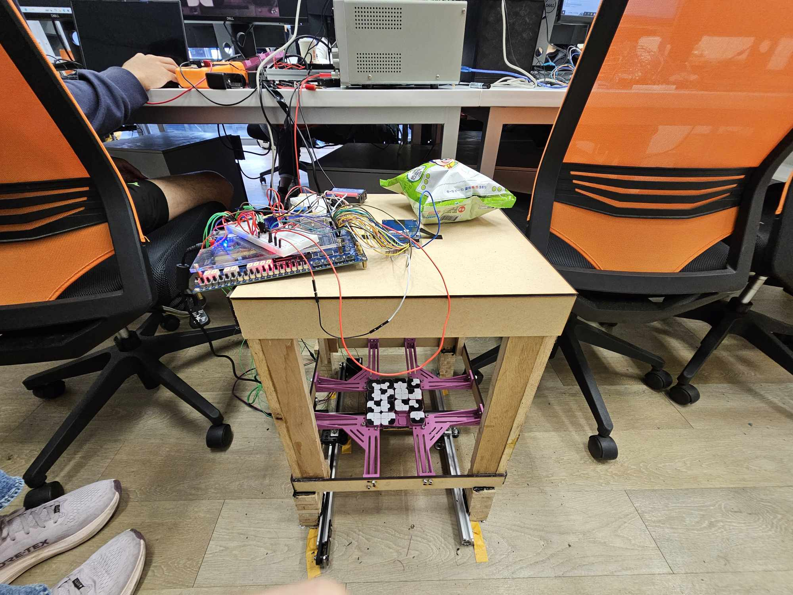
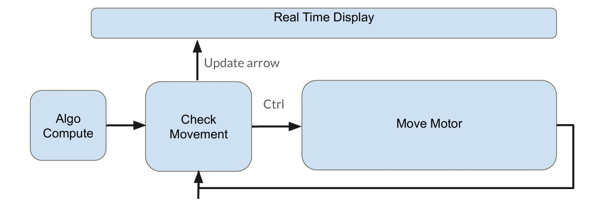
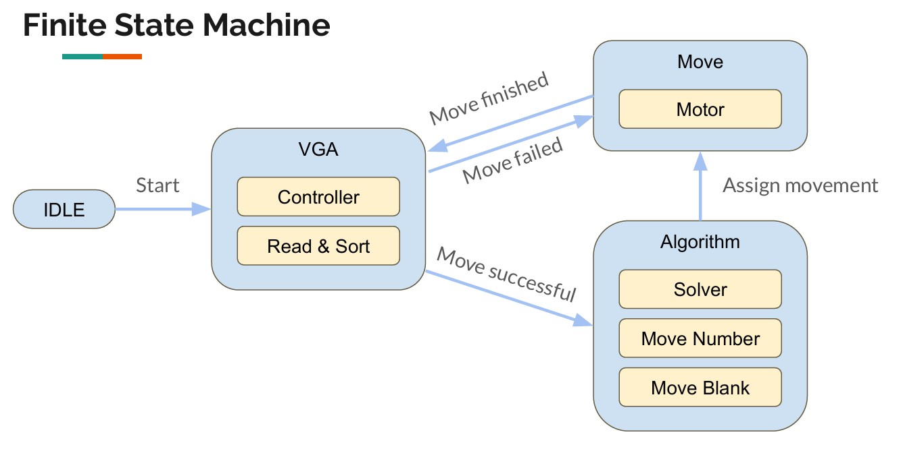
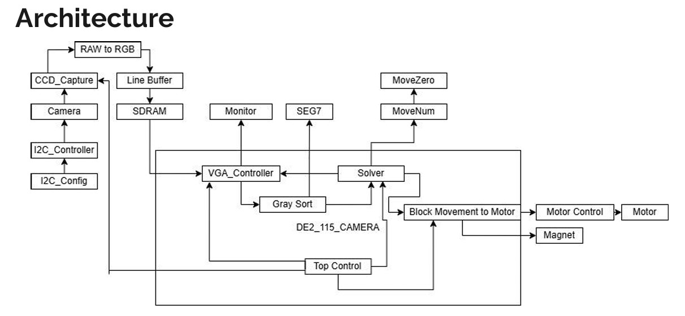

# DCS Lab Final Project

In this final project, our team use FPGA combined with TRDB-D5M camera, stepper motor, electromagnet to implement an automatic [klotski](https://www.youtube.com/watch?v=IIvCUGJCQRI) solver.

The whole view of our product:

### Demo

[The Demo can be found here.](https://youtu.be/J9KuMys705g)

### Time Flow

1. Use the camera to check the number of each block.

2. Input the numbers of the blocks into the algorithm.

3. After calculation, the solver will send movement to the motor control unit.

4. The motor control unit will plan a route based on previous few steps.

5. Move the physical klotski blocks.

6. Live movement and a hint of direction will be showned on the screen using VGA.

7. Check if the block is moved correctly; otherwise, redo the moving procedure.

8. Repeat 1. ~ 6. til the whole puzzle is solved.

### Finite State Machine

### System Architecture

### Camera Implementation

We modified the camera control and configuration files from [this page](https://download.terasic.com/).

### Motor and Electromagnet Implementation

We use TMC-2208 and a relay to control the nema 17 motors and the magnet respectively.

### Physical Architecture

Designed using CAD tools and saws.